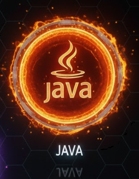

# Hi, I'm Russ! 👋

### 🎓 Education & Career
- 🏫 **Student:** Information Technology at [Bryant & Stratton College](https://www.bryantstratton.edu/)
- 💼 **Current Role:** Operations at The Red Stag Restaurant & Matterhorn Lounge
- 📍 **Location:** Wytheville, Virginia

### 💻 Technical Toolbox
- **Languages:** Python, Java
- **Interests:** Mobile Development, Android Modding, Systems IT
- **Philosophy:** Finding hidden patterns beneath consensus reality.

  
  
  
  
  

### 🎯 Skill Badges

  
  
  
  
  

### 🔥 What I'm Currently Working On
- 🎓 Pursuing my IT degree
- 📱 Exploring Android development and modding
- 🐍 Building Python projects
- ☕ Developing Java applications
- 🖥️ Learning system administration

### 🚀 Featured Projects
> *Coming soon - showcasing my best work in mobile development, Python automation, and system tools*

### 💡 Open to Collaborate On
- 📱 Android ROM development and modding
- 🐍 Python automation and scripting projects
- 🖥️ System administration tools and utilities
- 📚 Open-source IT learning resources

### 🎯 Goals for 2026
- [ ] Complete IT degree program
- [ ] Contribute to more open-source projects
- [ ] Build a portfolio of mobile applications
- [ ] Enhance system administration skills
- [ ] Share knowledge through documentation and guides

### 🌐 Connect with Me
- **XDA Forums:** [liquidlavaz](https://xdaforums.com/account/account-details)
- **GitHub:** [lavazlife](https://github.com/lavazlife)

### 📈 Profile Views

  

### 📊 GitHub Stats

  
  

  

### 🏆 GitHub Trophies

  

*"Reject the mundane."*

